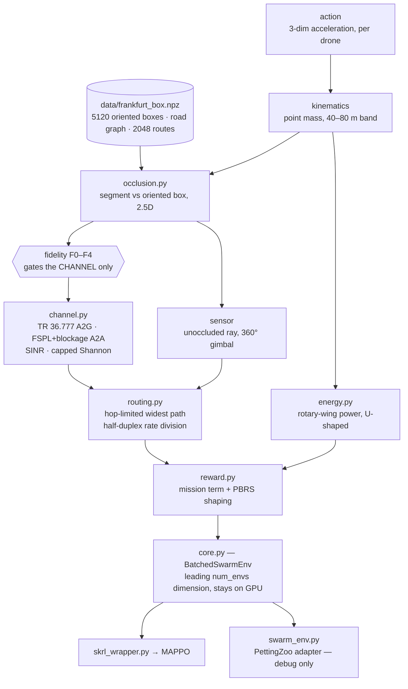

# How Much Channel Realism Does a Learned UAV Relay Swarm Need?

Multi-agent reinforcement learning for urban UAV relay chains under jamming.
MSc Artificial Intelligence thesis · simulator and experiment code.

A swarm of quadrotors must **observe** a vehicle moving through Frankfurt,
**relay** its video to a parked command vehicle at ≥15 Mbps over a multi-hop
chain, and **survive** on finite batteries — while a jammer riding the target
degrades every link near it. Buildings block line of sight, so the relay chain is
geometrically necessary rather than decorative.

---

## The claim being tested

> Multi-agent RL for UAV communication swarms is usually trained against a
> **connectivity-radius** abstraction: two agents are "connected" if they are
> within *R*. Policies learned that way fail under a physically realistic
> channel — and **occlusion** is the effect responsible.

It is falsifiable both ways. If radius-trained policies transfer fine, that is
also a result, and a useful one: it tells the field the abstraction is safe.

The contribution is **attribution**, not the existence of a gap. One policy is
trained per fidelity rung and *all of them are evaluated under the full model*,
so each rung adds exactly one physical effect and the differences say **which**
physics matters:

| Rung | Link capacity is… | Isolates the cost of ignoring |
|---|---|---|
| **F0** | `C_max` if `distance < R`, else 0 | — (the standard abstraction) |
| **F1** | + requires an unoccluded ray | **buildings** |
| **F2** | continuous: path loss → SINR → Shannon with a modulation cap | **binary** connectivity |
| **F3** | + jammer in the SINR denominator | the **threat** |
| **F4** | + multi-hop rate division `min(Cᵢ)/min(n,3)` | **relay cost** |

Neither free parameter in F0 is guessed. `C_max` is the channel model's own
modulation ceiling (**74 Mbps**), and `R` is **measured under F4 in the same
city — 524 m** — because an arbitrary radius makes the whole comparison
meaningless. See [*What has been measured*](#what-has-been-measured).

Two secondary questions ride along at no extra training cost: whether relational
structure helps and transfers (MLP → DeepSets → GNN, evaluated zero-shot at
`N ∈ {3,5,8}`), and whether the swarm **reconfigures its relay chain** as
sightlines change — and whether it does so *before* the incumbent link fails
rather than after.

---

## Status

Phase 0 (build and validate the simulator) runs to Feb 2027. The environment
**freezes end of March 2027**; everything before that is a pilot, everything
after is thesis material.

| Block | Delivers | State |
|---|---|---|
| **A** | channel, relay routing, rotary-wing energy, reward | ✅ done |
| **B** | Frankfurt LoD2 + OSM baked to tensors | ✅ done |
| **C** | batched occlusion, segment vs oriented box, 2.5D | ✅ done |
| **D** | batched env core, PettingZoo adapter, skrl wrapper | ✅ built — awaiting a CUDA re-run of the full env |
| **E** | presentation renderer + B0 scripted baseline | ✅ done |
| **F** | fidelity rungs F0–F4 as config flags | ✅ done |
| **G** | MAPPO integration + curriculum | ⬅️ **next** |
| **H** | offline Sionna validation of the closed-form channel | not started |

**There are no *learned* policies yet** — actor and critic networks are Block G.
What exists is a tested, benchmarked simulator with a scripted baseline and a
calibrated fidelity ladder: **288 tests**, 4 of which run only on CUDA.

Throughput, the constraint that decides whether the 45-run experiment matrix is
affordable: compiled occlusion measured **3.17 M env-steps/s** at
`num_envs = 1024` on an RTX 5090 — ~3170× the ≥1000 env-steps/s gate — with
occlusion at ~99 % of the step. The number the thesis actually reports is
wall-clock for a 10 M-step run *including the learner*, and that is Block G's
first task.

---

## What has been measured

Every figure below is regenerated by a committed script; none is quoted from
memory. Medians with IQR across ≥5 seeds, means across episodes within a seed.

### The bar a learned policy has to clear

`B0` is a scripted geometric controller that reads **exactly the same 108-dim
observation the neural actors will get** — no privileged access to the target's
position. It answers "is MARL earning its keep?" without a training run.

| policy | mission-capable | observed |
|---|---|---|
| random | 10.9 % [1.1] | 23.2 % |
| `B0-geodesic` (relays evenly on the straight line) | 47.1 % [3.1] | 86.0 % |
| **`B0` — the baseline to beat** | **57.2 % [3.5]** | 93.0 % |
| `B0-oracle` (given the true target position) | 56.8 % [3.2] | 93.9 % |

Two things fall out. **Perfect knowledge of the target is worth nothing
measurable** (−0.4 pp): relays do not need the target, they need the *observer*,
whose position is already in the observation. And the **36-point gap between
`observed` and `mission-capable` is pure relay geometry** — the swarm can see the
car 93 % of the time and get the video home 57 % of the time. That gap is the
problem this project studies.

### The fidelity ladder, as an environment

⚠️ **Not a research result.** RQ1 trains a policy per rung and evaluates all of
them under F4; `B0` is scripted and cannot be "trained under F0". These rows
describe **five environments**, not five policies.

| rung | mission-capable | observed | chain crosses a building |
|---|---|---|---|
| **F0** | 92.0 % | 92.0 % | **85.8 %** |
| **F1** | 27.9 % | 92.0 % | 0.0 % |
| **F2** | 92.0 % | 92.0 % | 65.5 % |
| **F3** | 83.1 % | 92.0 % | 62.0 % |
| **F4** (the full model) | 56.0 % | 92.0 % | 64.3 % |

`observed` is identical down the column by construction: **fidelity gates the
radio only**, so the camera and every diagnostic run on true building geometry at
every rung. Without that, the F0→F1 comparison would conflate sensor occlusion
with link occlusion and RQ1's primary result would be uninterpretable.

Under F0 the router sends the video through a building on **85.8 %** of steps —
the signature of the abstraction under test, and the reason that diagnostic is
never allowed to read the simplified geometry.

Two results worth flagging. **The ladder is cumulative in effects but not
monotone in difficulty**: F1 is the harshest rung, because it vetoes blocked
links outright where F4 charges them a blockage penalty and lets them carry.
And **F0, F2 and F3 all collapse `mission-capable` onto `observed`**, because the
rate divisor only arrives at F4 — it is the rung that makes the mission hard.

### Calibrating `R`, the one free parameter in F0

The pre-registered rule is *"the median link range measured under F4"*. Building
it revealed that the phrase has **two readings that differ by 2×** — the median
*length* of a realised working link (266 m), and the median *range* a link
reaches (524 m). Both are reported; the second is the headline, because the first
measures where the baseline happens to park its drones and would make F0
*stricter* than F4 — inverting the optimistic abstraction under test.

An independent method (matching mean connectivity degree between F0 and F4) gives
**418 m**, inside the ±25 % sensitivity band that is swept and reported anyway.
And the outcome barely moves: `B0`'s mission success under F0 is **flat at 93.4 %
across 0.75–1.5× of `R`**. The parameter is uncertain; the conclusion is not.

One number from that sweep is worth keeping on its own: at `R = 524 m`,
**32.0 % of the links F0 believes in run straight through a building** — the
abstraction error the F1 rung isolates, in a single figure.

---

## Quickstart

```bash
uv sync --extra dev          # `dev` is an EXTRA — plain `uv sync` omits pytest and ruff
uv run pytest                # 288 tests (4 run only on CUDA)
uv run ruff check . && uv run ruff format --check .
```

Python ≥3.12, PyTorch, [uv](https://docs.astral.sh/uv/) (`uv.lock` is
authoritative). Past the install, **nothing touches the network** — the Frankfurt
map is committed, and no geospatial library is imported at runtime.

Step the environment:

```python
import torch
from src.env.core import BatchedSwarmEnv, EnvConfig

env = BatchedSwarmEnv(EnvConfig(num_envs=1024, num_drones=5, device="cuda:0"))
obs = env.reset()
obs, reward, terminated, truncated, extras = env.step(
    torch.zeros(1024, 5, 3, device="cuda:0")  # normalised acceleration
)
extras["mission_capable"]  # (B,) the headline metric
extras["chain_occluded"]  # (B,) does the chosen relay chain cross a building?
```

Any rung of the ladder is one argument, and the flags derive from it — they
cannot be set individually, because a half-specified condition is not on the
ladder and would run happily anyway:

```python
env = BatchedSwarmEnv(EnvConfig(num_envs=1024, fidelity="F0"))  # default is "F4"
```

Watch an episode, with the swarm and the relay chain the router actually chose —
or draw the same policy at every rung side by side:

```bash
uv run python scripts/view_episode.py --route 7 --drones --save ep.mp4
uv run python scripts/render_episode.py --policy b0 --route 12 --compare-fidelity
```

> On Apple silicon, pass `--device mps` to the measurement scripts: occlusion
> compiles 25–73× there and an hour-long run becomes minutes. Note that
> `torch.Generator` streams differ per device, so the same seed draws *different
> episodes* — a device is part of a measurement's provenance, and numbers from
> different devices must not be compared.

---

## What the environment models



The sensor branch bypasses the fidelity gate on purpose: the rung changes what
the *radio* believes about buildings, never what the camera sees or what the
diagnostics report. That single arrow is most of what Block F is.

Every scenario parameter is fixed from an external source and the operating area
is then *solved for*, so that a single drone fails and the swarm succeeds:

| | Value | Basis |
|---|---|---|
| City / area | Frankfurt, 1500 m box at 50.11200 N, 8.67040 E | heterogeneous — low fabric gives a workable observation envelope, the tower cluster blocks air-to-air |
| Buildings | Hessen **LoD2**, 5120 **oriented** boxes | 100 % height coverage; axis-aligned boxes were measured and rejected (they fill 94 % of the box) |
| Transmit power | 30 dBm, **fixed** | UAV tactical MANET radios are 0.5–2 W |
| Carrier / bandwidth | 3.5 GHz / 10 MHz | so the rate target actually binds |
| Rate target | **15 Mbps** end-to-end | dual EO/IR feed at low latency — and measured to be the value at which the relay chain, not the sensor, becomes the constraint |
| Flight altitude | band **40–80 m** | floor = model validity; ceiling = how much air-to-air occlusion exists to study |
| Episode | 600 steps × 0.4 s = 240 s | covers the 1 → 2 → 3 hop escalation |
| Swarm | `N = 5` trained, 3/5/8 evaluated | training at one `N` only, so the transfer test stays zero-shot |

The **rate target** is the clearest example of how parameters are chosen here. It
was 5 Mbps, defensibly — one compressed HD stream. Then the scripted baseline
measured the chain's bottleneck at 8× that bar, which meant `mission-capable` was
identical to `observed` for every policy and a *script* scored 93 % with the
metric saturated. The radio link never bound, so the relay chain was necessary
but never difficult — the wrong shape for a thesis about relay geometry. At
15 Mbps the binding constraint moves from the sensor to the chain. The
measurement chose *among* defensible values rather than inventing one.

---

## How this repo works

Three habits do most of the work, and they are worth knowing before reading any
of the code.

**Assumptions get measured, not trusted.** OSM building heights were checked and
rejected at 58 % area-weighted coverage in favour of LoD2 at 100 %. The canyon
ratio, street width, observation envelope and sightline distribution were all
measured on the real box rather than assumed. The 830 m sensor range was shown to
be *non-binding* — 99.8 % of sightlines are shorter — which is a stronger
statement than any defence of the value itself.

**Rejections are recorded with their evidence.**
[`docs/DECISIONS.md`](docs/DECISIONS.md) exists so that neither a human nor an AI
session re-proposes, six months later, something that was already killed. Every
entry carries the measurement that killed it — including entries where the
original *reasoning* turned out to be wrong even though the conclusion survived,
and entries where a prediction the project had written down was later reversed by
its own measurements.

**Numbers in the docs are regenerable.** Anything quoted in a design document has
a script that reproduces it. Nothing is asserted from memory:

```bash
uv run python scripts/measure_envelope.py   # altitude band, sensor envelope, cue,
                                            # link budget, W1, policy floor/ceiling
uv run python scripts/measure_sightlines.py # canyon ratio and sightline distributions
uv run python scripts/scenario_design.py    # the scenario sizing trade-off table
uv run python scripts/eval_baseline.py      # the B0 ladder, hop distribution, RQ3
uv run python scripts/calibrate_r.py        # R, by two methods, with the sensitivity sweep
uv run python scripts/eval_fidelity.py      # the F0–F4 tables, throughput, scale check
uv run python scripts/bench_occlusion.py    # occlusion throughput and device parity
uv run python scripts/bench_env.py          # whole-env throughput
```

A fourth habit is newer and specific to a frozen environment: **behaviour that
must not change is recorded, not just tested.** `data/f4_golden.pt.gz` is a
complete trace of what the environment did before the fidelity ladder was built —
every tensor, over three scenarios chosen to cover every branch of the step. A
test asserts the current code still reproduces it element for element, which is
what proves the ladder's top rung is still the environment all the earlier
measurements were taken in.

---

## Repository layout

```
src/env/        channel · routing · energy · reward · occlusion · core (the env)
src/baselines/  B0 scripted control + the rollout/metrics harness
src/viz/        shared scene drawing, presentation figures and videos
src/training/   skrl multi-agent wrapper
src/models/     GNN / DeepSets / MLP actor-critic          (Block G)
scripts/        offline data prep, measurement, benchmarks, episode viewers
data/           frankfurt_box.npz — the frozen environment
                f4_golden.pt.gz  — the frozen pre-Block-F behavioural trace
docs/           design records, read on demand
tests/          cross-module only; unit tests are CO-LOCATED with their module
```

`data/frankfurt_box.npz` (9.1 MB) is **committed on purpose**, not treated as a
build product. OpenStreetMap and the LoD2 service both change continuously, so
re-running the pipeline in 2027 would silently produce a different map — which is
exactly what the March 2027 environment freeze exists to prevent. The file in git
*is* the environment; `scripts/prep_osm.py` only documents how it was made.

---

## Where to go next

| Document | Read it when |
|---|---|
| [`docs/ROADMAP.md`](docs/ROADMAP.md) | **start here** — claim → experiment → block → thesis chapter |
| [`AGENTS.md`](AGENTS.md) | before changing anything — current state, hard rules, settled parameters |
| [`docs/DECISIONS.md`](docs/DECISIONS.md) | before proposing anything — what was already tried and rejected |
| [`docs/THESIS_PLAN.md`](docs/THESIS_PLAN.md) | research design: questions, conditions, metrics, compute budget |
| [`docs/PHYSICS.md`](docs/PHYSICS.md) | channel, routing, energy, scenario derivation |
| [`docs/ENVIRONMENT.md`](docs/ENVIRONMENT.md) | episodes, the cue, curriculum, observation spec |
| [`docs/REWARD.md`](docs/REWARD.md) · [`docs/MODELS.md`](docs/MODELS.md) | reward design · actor/critic rules |
| [`docs/NEGATIVE_RESULTS.md`](docs/NEGATIVE_RESULTS.md) | before proposing adaptive transmit power |
| [`docs/BLOCK_B.md`](docs/BLOCK_B.md) · [`C`](docs/BLOCK_C.md) · [`D`](docs/BLOCK_D.md) | geometry · occlusion · the env core |
| [`docs/BLOCK_E.md`](docs/BLOCK_E.md) · [`F`](docs/BLOCK_F.md) · [`G`](docs/BLOCK_G.md) | the baseline · the fidelity ladder · the training block |

---

## Data provenance and licensing

- **Buildings** — Hessen LoD2 building models via the INSPIRE WFS, licensed
  **dl-de/zero-2.0**. Footprints and measured heights only; no CityGML parsing.
- **Road graph** — © OpenStreetMap contributors, licensed under the
  **Open Database License (ODbL)**.
- Both are redistributed in derived tensor form inside
  `data/frankfurt_box.npz`.

A licence for the code in this repository has not been chosen yet. Until one is
added, no permissions are granted beyond viewing.

## Caveats worth stating up front

Several constants are carried as `TODO(verify)` and must be checked against
primary sources before they appear in the methodology chapter: the 3GPP TR 36.777
UMi-AV path-loss coefficients, the rotorcraft aerodynamic parameters, and the
830 m sensor recognition range (which is documented as non-binding rather than
defended).

Two scope limits are deliberate. **Sim-to-real transfer is out of scope.** And
RQ2's cross-city generalisation column was **cut**: Hessen's LoD2 service covers
no other city, so a second map is a full geometry-pipeline rebuild rather than
one extra OSM extract, and that does not fit before the freeze. The architecture
comparison therefore tests transfer across *swarm size*, not across urban form —
stated plainly rather than glossed, and left as future work.
