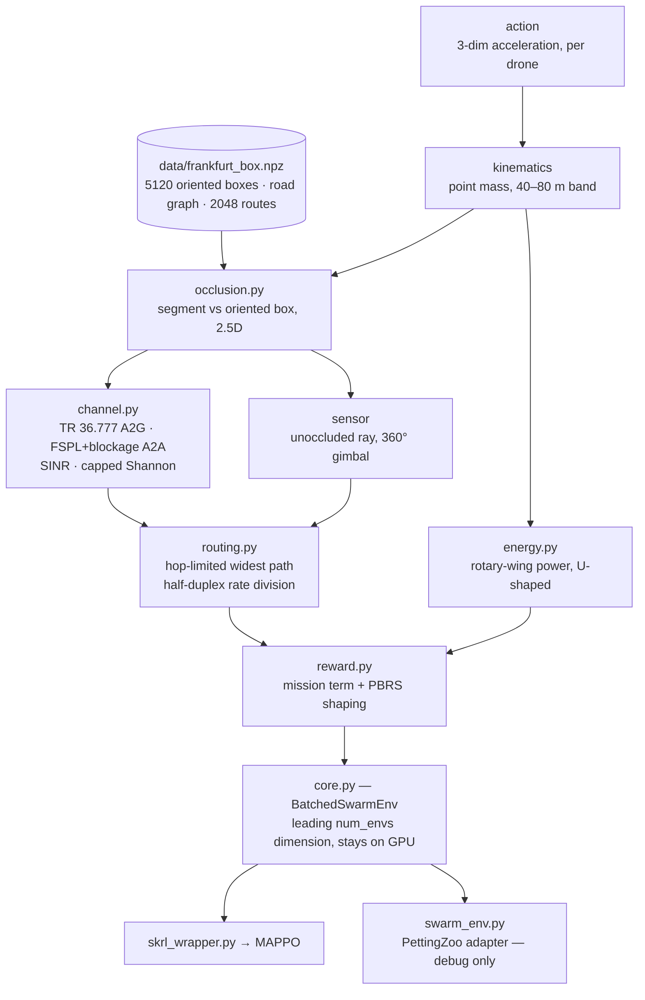

# How Much Channel Realism Does a Learned UAV Relay Swarm Need?

Multi-agent reinforcement learning for urban UAV relay chains under jamming.
MSc Artificial Intelligence thesis · simulator and experiment code.

A swarm of quadrotors must **observe** a vehicle moving through Frankfurt,
**relay** its video to a parked command vehicle at ≥5 Mbps over a multi-hop
chain, and **survive** on finite batteries — while a jammer riding the target
degrades every link near it. Buildings block line of sight, so the relay chain is
geometrically necessary rather than decorative.

---

## The claim being tested

> Multi-agent RL for UAV communication swarms is usually trained against a
> **connectivity-radius** abstraction: two agents are "connected" if they are
> within *R*. Policies learned that way fail under a physically realistic
> channel — and **occlusion** is the effect responsible.

It is falsifiable both ways. If radius-trained policies transfer fine, that is
also a result, and a useful one: it tells the field the abstraction is safe.

The contribution is **attribution**, not the existence of a gap. One policy is
trained per fidelity rung and all are evaluated under the full model, so each
rung adds exactly one physical effect and the differences say *which* physics
matters:

| Rung | Link capacity is… | Isolates the cost of ignoring |
|---|---|---|
| **F0** | `C_max` if `distance < R`, else 0 | — (the standard abstraction) |
| **F1** | + requires an unoccluded ray | **buildings** |
| **F2** | continuous: path loss → SINR → Shannon with a modulation cap | **binary** connectivity |
| **F3** | + jammer in the SINR denominator | the **threat** |
| **F4** | + multi-hop rate division `min(Cᵢ)/min(n,3)` | **relay cost** |

Two secondary questions ride along at no extra training cost: whether relational
structure helps and transfers (MLP → DeepSets → GNN, evaluated zero-shot at
`N ∈ {3,5,8}`), and whether the observer role **hands off** as sightlines change
— and whether that handoff is *anticipatory*.

---

## Status

Phase 0 (build and validate the simulator) runs to Feb 2027. The environment
**freezes end of March 2027**; everything before that is a pilot, everything
after is thesis material.

| Block | Delivers | State |
|---|---|---|
| **A** | channel, relay routing, rotary-wing energy, reward | ✅ done |
| **B** | Frankfurt LoD2 + OSM baked to tensors | ✅ done |
| **C** | batched occlusion, segment vs oriented box, 2.5D | ✅ done |
| **D** | batched env core, PettingZoo adapter, skrl wrapper | ✅ built — awaiting a CUDA re-run of the full env |
| **E** | renderer + B0 scripted baseline | ⬅️ next |
| **F** | fidelity rungs F0–F4 as config flags | not started |
| **G** | MAPPO integration + curriculum | not started |
| **H** | offline Sionna validation of the closed-form channel | not started |

**There are no trained policies and no results yet.** Actor and critic networks
are Block G. What exists is a tested, benchmarked simulator: **208 tests**
(plus 4 that run only on CUDA).

Throughput, the constraint that decides whether the 45-run experiment matrix is
affordable: compiled occlusion measured **3.17 M env-steps/s** at
`num_envs = 1024` on an RTX 5090 — ~3170× the ≥1000 env-steps/s gate — with
occlusion at ~99 % of the step. The full env has been profiled locally and shows
the same shape; the CUDA figure for the complete step is still outstanding.

---

## Quickstart

```bash
uv sync --extra dev          # `dev` is an EXTRA — plain `uv sync` omits pytest and ruff
uv run pytest                # 208 tests, +4 CUDA-only skips
uv run ruff check . && uv run ruff format --check .
```

Python ≥3.12, PyTorch, [uv](https://docs.astral.sh/uv/) (`uv.lock` is
authoritative). Past the install, **nothing touches the network** — the Frankfurt
map is committed, and no geospatial library is imported at runtime.

Step the environment:

```python
import torch
from src.env.core import BatchedSwarmEnv, EnvConfig

env = BatchedSwarmEnv(EnvConfig(num_envs=1024, num_drones=5, device="cuda:0"))
obs = env.reset()
obs, reward, terminated, truncated, extras = env.step(
    torch.zeros(1024, 5, 3, device="cuda:0")          # normalised acceleration
)
extras["mission_capable"]      # (B,) the headline metric
extras["chain_occluded"]       # (B,) does the chosen relay chain cross a building?
```

Watch an episode, with the swarm and the relay chain the router actually chose:

```bash
uv run python scripts/view_episode.py --route 7 --drones --save ep.mp4
```

---

## What the environment models



Every scenario parameter is fixed from an external source and the operating area
is then *solved for*, so that a single drone fails and the swarm succeeds:

| | Value | Basis |
|---|---|---|
| City / area | Frankfurt, 1500 m box at 50.11200 N, 8.67040 E | heterogeneous — low fabric gives a workable observation envelope, the tower cluster blocks air-to-air |
| Buildings | Hessen **LoD2**, 5120 **oriented** boxes | 100 % height coverage; axis-aligned boxes were measured and rejected (they fill 94 % of the box) |
| Transmit power | 30 dBm, **fixed** | UAV tactical MANET radios are 0.5–2 W |
| Carrier / bandwidth | 3.5 GHz / 10 MHz | so the 5 Mbps target actually binds |
| Flight altitude | band **40–80 m** | floor = model validity; ceiling = *derived* — above it one drone can do the mission alone |
| Episode | 600 steps × 0.4 s = 240 s | covers the 1 → 2 → 3 hop escalation |
| Swarm | `N = 5` trained, 3/5/8 evaluated | |

The altitude ceiling is the clearest example of how parameters are set here. It
is not a comfort margin: above 80 m a *best-placed single drone* becomes
mission-capable on its own (3.3 % of the time at 80 m, 57.4 % at 120 m), which
would dissolve the reason a swarm exists. The number is derived from the
scenario's own defining condition, so no regulatory citation is load-bearing.

---

## How this repo works

Three habits do most of the work, and they are worth knowing before reading any
of the code.

**Assumptions get measured, not trusted.** OSM building heights were checked and
rejected at 58 % area-weighted coverage in favour of LoD2 at 100 %. The canyon
ratio, street width, observation envelope and sightline distribution were all
measured on the real box rather than assumed. The 830 m sensor range was shown to
be *non-binding* — 99.8 % of sightlines are shorter — which is a stronger
statement than any defence of the value itself.

**Rejections are recorded with their evidence.**
[`docs/DECISIONS.md`](docs/DECISIONS.md) exists so that neither a human nor an AI
session re-proposes, six months later, something that was already killed. Every
entry carries the measurement that killed it — including entries where the
original *reasoning* turned out to be wrong even though the conclusion survived.

**Numbers in the docs are regenerable.** Anything quoted in a design document has
a script that reproduces it. Nothing is asserted from memory:

```bash
uv run python scripts/measure_envelope.py     # altitude band, sensor envelope, cue,
                                              # link budget, W1, policy floor/ceiling
uv run python scripts/measure_sightlines.py   # canyon ratio and sightline distributions
uv run python scripts/scenario_design.py      # the scenario sizing trade-off table
uv run python scripts/bench_occlusion.py      # occlusion throughput (re-run on CUDA)
uv run python scripts/bench_env.py            # whole-env throughput, both units
```

---

## Repository layout

```
src/env/        channel · routing · energy · reward · occlusion · core (the env)
src/training/   skrl multi-agent wrapper
src/models/     GNN / DeepSets / MLP actor-critic          (Block G)
scripts/        offline data prep, measurement, benchmarks, episode viewer
data/           frankfurt_box.npz — the frozen environment
docs/           design records, read on demand
tests/          cross-module only; unit tests are CO-LOCATED with their module
```

`data/frankfurt_box.npz` (8.7 MB) is **committed on purpose**, not treated as a
build product. OpenStreetMap and the LoD2 service both change continuously, so
re-running the pipeline in 2027 would silently produce a different map — which is
exactly what the March 2027 environment freeze exists to prevent. The file in git
*is* the environment; `scripts/prep_osm.py` only documents how it was made.

---

## Where to go next

| Document | Read it when |
|---|---|
| [`docs/ROADMAP.md`](docs/ROADMAP.md) | **start here** — claim → experiment → block → thesis chapter |
| [`AGENTS.md`](AGENTS.md) | before changing anything — current state, hard rules, settled parameters |
| [`docs/DECISIONS.md`](docs/DECISIONS.md) | before proposing anything — what was already tried and rejected |
| [`docs/THESIS_PLAN.md`](docs/THESIS_PLAN.md) | research design: questions, conditions, metrics, compute budget |
| [`docs/PHYSICS.md`](docs/PHYSICS.md) | channel, routing, energy, scenario derivation |
| [`docs/ENVIRONMENT.md`](docs/ENVIRONMENT.md) | episodes, the cue, curriculum, observation spec |
| [`docs/REWARD.md`](docs/REWARD.md) · [`docs/MODELS.md`](docs/MODELS.md) | reward design · actor/critic rules |
| [`docs/NEGATIVE_RESULTS.md`](docs/NEGATIVE_RESULTS.md) | before proposing adaptive transmit power |
| [`docs/BLOCK_B.md`](docs/BLOCK_B.md) · [`C`](docs/BLOCK_C.md) · [`D`](docs/BLOCK_D.md) | geometry · occlusion · the env core |

---

## Data provenance and licensing

- **Buildings** — Hessen LoD2 building models via the INSPIRE WFS, licensed
  **dl-de/zero-2.0**. Footprints and measured heights only; no CityGML parsing.
- **Road graph** — © OpenStreetMap contributors, licensed under the
  **Open Database License (ODbL)**.
- Both are redistributed in derived tensor form inside
  `data/frankfurt_box.npz`.

A licence for the code in this repository has not been chosen yet. Until one is
added, no permissions are granted beyond viewing.

## Caveats worth stating up front

Several constants are carried as `TODO(verify)` and must be checked against
primary sources before they appear in the methodology chapter: the 3GPP TR 36.777
UMi-AV path-loss coefficients, the rotorcraft aerodynamic parameters, and the
830 m sensor recognition range (which is documented as non-binding rather than
defended). Sim-to-real transfer is explicitly out of scope.
