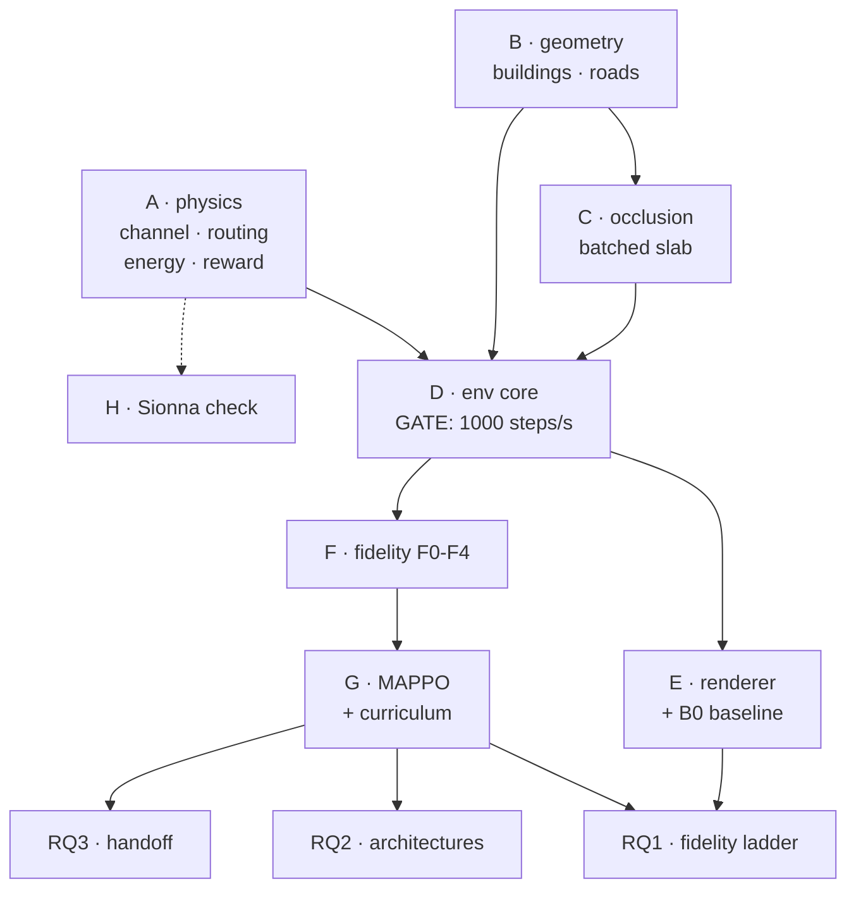

# Roadmap — the red thread

One page that connects **why the thesis exists** → **what must be proven** →
**which experiment proves it** → **what software that needs** → **which block
builds it** → **which chapter it becomes**.

If you are working on a task and cannot trace it upward through this chain, stop
and ask why you are doing it.

Research design detail: [`THESIS_PLAN.md`](THESIS_PLAN.md).
Current state and rules: [`../AGENTS.md`](../AGENTS.md).

---

## The claim

> **Multi-agent RL for UAV communication swarms is usually trained against a
> connectivity-radius abstraction. Policies learned that way fail under a
> physically realistic channel — and occlusion is the effect responsible.**

Falsifiable both ways. If radius-trained policies transfer fine, that is also a
result, and a useful one: it tells the field the abstraction is safe.

### Why it is worth making
The gap is real and checkable in the literature: swarm-comms MARL abstracts the
channel, while joint trajectory-and-power work is single-UAV or centralised
optimisation without buildings. Nobody has measured **what the abstraction
costs**. The answer is directly actionable — it tells people which physics their
simulator must include.

---

## The chain

| The claim needs… | …which requires… | …delivered by |
|---|---|---|
| A reference channel nobody can dismiss | standards-based path loss, SINR, rate, routing, energy — all tested | **A** ✅ |
| Occlusion that is real, not a parameter | actual Frankfurt footprints and heights | **B** |
| Occlusion computed fast enough to train against | batched torch ray-vs-box, 2.5D | **C** |
| Enough samples to make 45 runs affordable | batched env at ≥1000 steps/s | **D** |
| Proof MARL earns its keep | a scripted geometric baseline (B0) | **E** |
| The independent variable itself | F0–F4 as config flags on one env | **F** |
| Policies to compare | MAPPO + a curriculum that actually learns | **G** |
| A channel model a telecoms examiner accepts | offline Sionna agreement plot | **H** |



**Critical path: B → C → D → F → G.** Everything else hangs off it.
**E** can run alongside D once the env steps. **H** is fully parallel and touches
only the methodology chapter.

---

## Blocks

Each gets a full spec when it becomes *next* — written just-in-time, because a
spec written six months early goes stale. Only the current block has one:
[`BLOCK_C.md`](BLOCK_C.md). [`BLOCK_B.md`](BLOCK_B.md) is kept as the record of
what was measured and what the artefact contains.

| Block | Delivers | Serves | Gate | Fails if |
|---|---|---|---|---|
| **A** ✅ | channel, routing, energy, reward — pure, batched, tested | all | 103 tests, hand-computed | — |
| **B** ✅ | Frankfurt buildings + road graph as tensors; route sampler | RQ1 (occlusion is the hypothesis), RQ2 (2nd city), RQ3 (sightlines cause handoff) | height coverage verified, not assumed → **LoD2, 100 %** | heights are missing → the map is useless and the scenario is unfounded |
| **C** ⬅️ | batched segment-vs-**oriented**-box occlusion, 2.5D | RQ1 (the F1 rung *is* occlusion) | matches a slow shapely reference on random geometry | too slow → blows D's throughput gate. `M = 4220`, so a broad phase is mandatory |
| **D** | batched env core + PettingZoo adapter | everything | **≥1000 env-steps/s on GPU** | below gate → 45 runs unaffordable, matrix must shrink |
| **E** | renderer + B0 scripted heuristic | sanity floor for every RQ; all figures and videos | B0 completes an episode on video | no B0 → cannot answer "is MARL needed at all?" |
| **F** | F0–F4 as config flags on one env | **RQ1 directly** | all five run; `R` calibrated under F4 | uncalibrated `R` → RQ1 comparison is meaningless |
| **G** | MAPPO + curriculum | everything | one toy run beats random | nothing learns → the usual place projects stall |
| **H** | offline Sionna agreement plot | methodology credibility | plot exists | — (optional, cut freely) |

**Hand to an agent:** B, C, E — well-specified and testable.
**Do yourself:** A, D, G — judgement calls and the throughput gate.

---

## From work to chapters

The final deliverable is a written document. Mapping blocks and experiments onto
chapters shows what can be written *early*:

| Chapter | Fed by | Writable |
|---|---|---|
| 1 Introduction | the claim above | last |
| 2 Background & Related Work | literature | **now** — independent of all code |
| 3 System Model | **A, B, C, H** + `PHYSICS.md` | **now, once B lands** |
| 4 Method | **F, G** + `REWARD.md`, `MODELS.md`, `ENVIRONMENT.md` | after the env freeze |
| 5 Experimental Design | `THESIS_PLAN.md` §3–4 | after the env freeze |
| 6 Results | E1 / E2 / E3 / E4 | Apr–Jun 2027 |
| 7 Discussion | + `NEGATIVE_RESULTS.md` | Jun–Jul 2027 |
| 8 Conclusion & Future Work | — | last |

> **Chapters 2 and 3 are ~40 % of the page count and neither depends on a single
> training run.** The physics is frozen and tested; `PHYSICS.md` and
> `NEGATIVE_RESULTS.md` are already most of Chapter 3's substance and a chunk of
> Chapter 7. Writing them during Phase 0, while builds and pilots run, is the
> single biggest scheduling win available — and it is why the environment freeze
> at end of March matters so much: **after the freeze, Chapters 3–5 cannot change.**

---

## Where we are

```
A ████████████████████  done   physics, tested, frozen
B ████████████████████  done   geometry baked → data/frankfurt_box.npz
C ░░░░░░░░░░░░░░░░░░░░  next   docs/BLOCK_C.md — opens with a data fix
D ░░░░░░░░░░░░░░░░░░░░         ← the gate that decides the experiment matrix
E ░░░░░░░░░░░░░░░░░░░░
F ░░░░░░░░░░░░░░░░░░░░
G ░░░░░░░░░░░░░░░░░░░░         ← the usual place projects of this shape stall
H ░░░░░░░░░░░░░░░░░░░░
```

**Chapter 3 is now writable.** `PHYSICS.md` was already most of its substance;
Block B replaced its remaining assumptions with measurements (canyon ratio,
sightline distribution, observation envelope) and produced the box figure. That
is the single biggest scheduling win available before the March 2027 freeze.

**Now → Feb 2027:** Phase 0. Build B–H. Write Chapters 2 and 3 in parallel.
**End Mar 2027:** environment freeze. Pilots before, thesis material after.
**Apr–Aug 2027:** run the 45 reported experiments, write 4–8.

---

## Two things that decide whether this works

**D's throughput gate.** At ≥1000 steps/s the 45-run matrix costs ~120 GPU-hours
and everything in `THESIS_PLAN.md` §3 is affordable. Below it, the matrix has to
shrink and RQ2 is the first thing cut. Measure it before building on top of the
env — not after.

**G's curriculum.** Getting MAPPO to learn anything at all is the classic failure
point for projects of this shape. Budget real calendar time, and remember the
curriculum must be *identical across all fidelity conditions* or RQ1 is
confounded ([`ENVIRONMENT.md`](ENVIRONMENT.md) → Curriculum).

If either slips badly, the honest fallback is to cut RQ2 and RQ3 and defend RQ1
alone. RQ1 is the contribution; the other two are supporting evidence.
